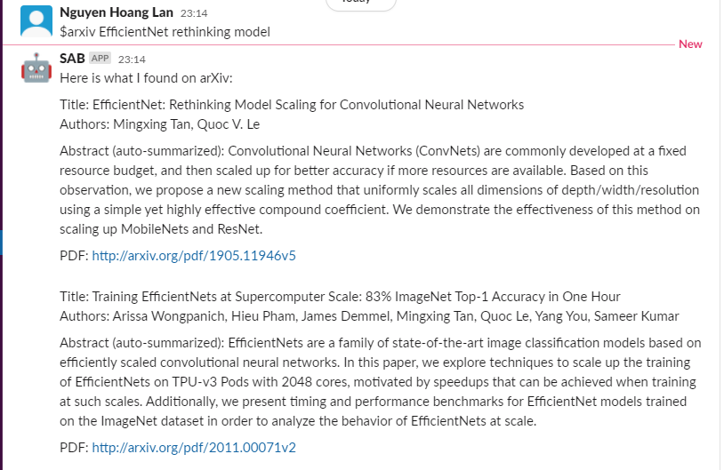
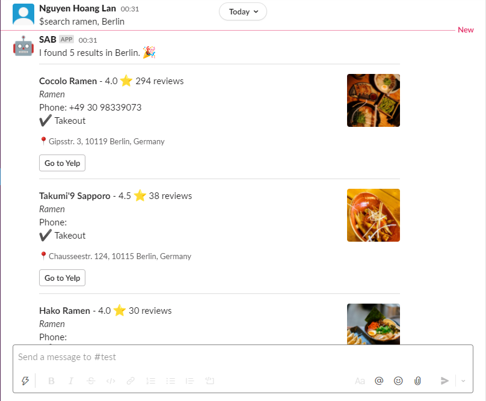
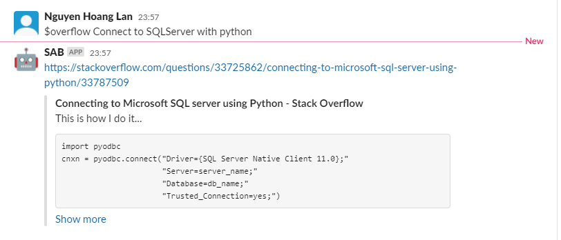
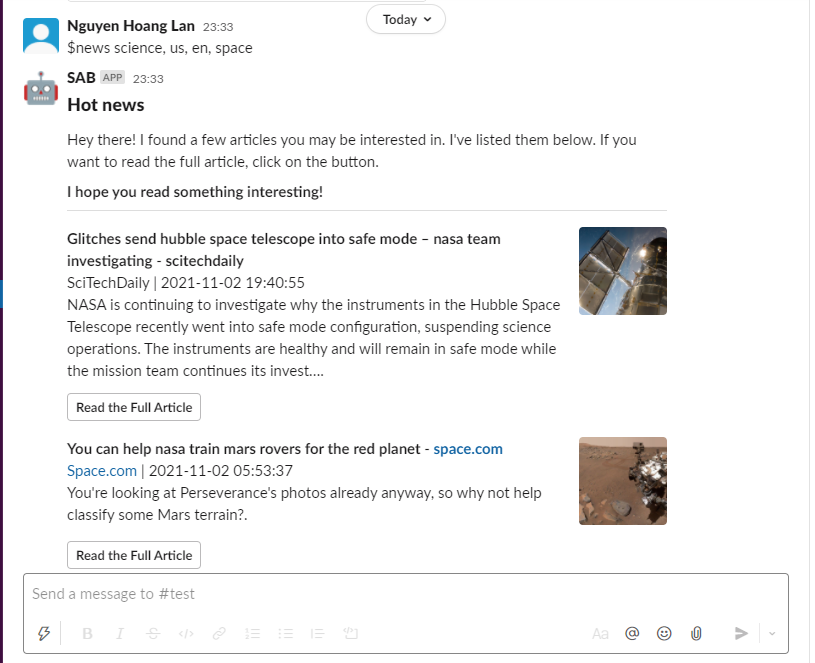

# <p align="center"> S.A.B - an epical Slack Bot  </p>

<p align="center">
 <a></a>
  <br>
  <a style="font-size: 40px; color:red;"> <strong> I'm S.A.B, let me help you </strong> </a>
</p>


<p align="center">
<a href="https://www.codefactor.io/repository/github/lannguyen0910/sab/overview/master"></a>
<a href="https://www.python.org/"></a>
<a href="./LICENSE"></a>
<a href="https://slack.com/"></a>
 
 </p>
<!-- 
# **Download and create API keys**
[ngrok](https://ngrok.com/download): route public IP addresses to the slackbot's local webserver <br/>
[api-slack](https://api.slack.com/apps): create an app in slack api to set up the bot <br/>
[yelp](https://www.yelp.com/login?return_url=%2Fdevelopers%2Fv3%2Fmanage_app): set up search engine **(Make sure to use VPN (America region,..) because they don't allow users with Asia or Africa IP addresses to sign up for an account)** -->

<!-- # **Setup**
**Create conda env for the project**
```
conda create --name <project-name>
```
**Install all the dependencies by using the command below**
```
pip install -r requirements.txt
``` -->

<details open>
 <summary><strong>Status</strong></summary>
 <strong><i>[03/11/2021]</i></strong> S.A.B is still in development stage (optimize + refactor + improve) and has some drawbacks. Documentation is on the way. If you want to integrate to your own slack channel, contact me for guidance.
</details>

## What is S.A.B ?
Inspired from [K.A.I-Discord Bot](https://github.com/kaylode/KAI). S.A.B is created as a Slack bot that can do a lot of things to experience work and play. From basic usage such as searching for places, searching for code, searching for news, searching wikipedia, summarize papers, translating multiple languages (text2text, text2speech),.. to even more intelligence tasks **(in the future)** like computer vision (classification, detection, segmentation, etc), natural language processing (telling jokes, answering questions, chatting) responding with voice.

<!-- <a name="myfootnote1"><strong><i>[*]</i></strong></a>: **_With help of GPT-3 technology._** -->

## What can S.A.B do ?
- [Wiki Search](https://github.com/lannguyen0910/SAB/wiki/Features:-Wiki-Search)
- [Covid 19 Information](https://github.com/lannguyen0910/SAB/wiki/Features:-Covid-Analysis)
- [StackOverflow Search](https://github.com/lannguyen0910/SAB/wiki/Features:-SlackOverflow)
- [News Search](https://github.com/lannguyen0910/SAB/wiki/Features:-News-Search)
- [Location Search](https://github.com/lannguyen0910/SAB/wiki/Features:-Location-Search)
- [Papers Summarize](https://github.com/lannguyen0910/SAB/wiki/Features:-Paper-Summerize)
- [Google Translate](https://github.com/lannguyen0910/SAB/wiki/Features:-Google-Translate)
- [Google Text-to-speech](https://github.com/lannguyen0910/SAB/wiki/Features:-Text-to-Speech)
- Email sending (Processing)
- Shared calendar (Processing)
- Play sounds/music to the whole channel (Processing)
- Basic Computer Vision Model API (Processing)


# **Set up**
- Basic app setup
```
pip install -r requirements.txt
```
- Contact me for more setup (API keys, OAuth): [mail](mailto:18120051@student.hcmus.edu.vn)

# **How to run S.A.B**
```
python main.py
```
- Run this to clear cache (__pycache__) when finish running
```
run.bat
```

- Testing:
```
python tests/news/<test_module>.py
```


# **Demo**
<h3>Paper summarization</h3>



<h3>Location search</h3>



<h3>Stackoverflow search</h3>



<h3>News search</h3>



# **References**
- **Adapted from _Kaylode_: [Discord Bot](https://github.com/kaylode/KAI/)**
- **[Starter Tutorial](https://www.youtube.com/watch?v=KJ5bFv-IRFM&list=PLzMcBGfZo4-kqyzTzJWCV6lyK-ZMYECDc)**
- **[SlackOverflow](https://github.com/karan/slack-overflow)**

# **Contact**
<p align="center">  

 </p>
